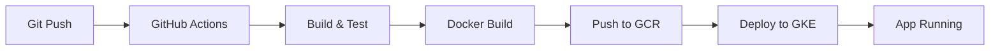

# 🔐 Configuração de Secrets no GitHub para Deploy Automático no GKE

## ✅ Pré-requisitos Completados

- [x] Service account `github-actions` criada no GCP
- [x] Permissões IAM configuradas (Container Admin, Storage Admin, Service Account User)
- [x] Chave JSON gerada (`gcp-key.json`)
- [x] Arquivo adicionado ao `.gitignore`

## 📋 Secrets Necessários

### 1. GCP_CREDENTIALS
Conteúdo completo do arquivo `gcp-key.json`

### 2. GCP_PROJECT_ID
Valor: `project-62120210-43eb-4d93-954`

## 🚀 Passo a Passo para Adicionar Secrets

### Opção 1: Via Interface Web (Recomendado)

1. **Acesse a página de secrets do repositório:**
   ```
   https://github.com/guilhermesoatto/TheThroneOfGames/settings/secrets/actions
   ```

2. **Adicione o primeiro secret (GCP_CREDENTIALS):**
   - Clique em **"New repository secret"**
   - **Name**: `GCP_CREDENTIALS`
   - **Value**: Copie TODO o conteúdo do arquivo `gcp-key.json` (incluindo as chaves `{` e `}`)
   - Clique em **"Add secret"**

3. **Adicione o segundo secret (GCP_PROJECT_ID):**
   - Clique novamente em **"New repository secret"**
   - **Name**: `GCP_PROJECT_ID`
   - **Value**: `project-62120210-43eb-4d93-954`
   - Clique em **"Add secret"**

### Opção 2: Via GitHub CLI (gh)

```powershell
# Instalar GitHub CLI (se não tiver)
winget install GitHub.cli

# Autenticar
gh auth login

# Adicionar secrets
gh secret set GCP_CREDENTIALS < gcp-key.json
gh secret set GCP_PROJECT_ID -b "project-62120210-43eb-4d93-954"
```

## ✨ Verificação dos Secrets

Após adicionar, você deve ver na página de secrets:

```
✅ GCP_CREDENTIALS          Updated X seconds ago
✅ GCP_PROJECT_ID           Updated X seconds ago
```

**Nota**: Por segurança, o GitHub não permite visualizar o valor dos secrets depois de adicionados.

## 🎯 Próximos Passos

### 1. Fazer Push para Ativar o Pipeline

```powershell
# Verificar branch atual
git branch

# Fazer push para master (ou main)
git push origin master
```

### 2. Acompanhar a Execução do Workflow

1. Acesse: https://github.com/guilhermesoatto/TheThroneOfGames/actions
2. Clique no workflow mais recente
3. Aguarde a execução dos 6 jobs:
   - ✅ **build-and-test**: Testes unitários (120+ testes)
   - ✅ **docker-build**: Build das 3 imagens Docker
   - ✅ **performance-tests**: Testes de performance (30s)
   - ✅ **security-scan**: Scan de vulnerabilidades (Trivy)
   - ✅ **deploy-gke**: Deploy automático no GKE
   - ✅ **summary**: Relatório consolidado

### 3. Verificar Deploy no Cluster

Após o workflow concluir com sucesso:

```powershell
# Configurar PATH do gcloud
$env:Path = "$env:LOCALAPPDATA\Google\Cloud SDK\google-cloud-sdk\bin;$env:Path"

# Verificar pods
kubectl get pods -n thethroneofgames

# Verificar serviços
kubectl get services -n thethroneofgames

# Verificar HPA (Horizontal Pod Autoscaler)
kubectl get hpa -n thethroneofgames

# Verificar Ingress (IP externo)
kubectl get ingress -n thethroneofgames
```

**Saída esperada:**
```
NAME                                READY   STATUS    RESTARTS   AGE
catalogo-api-xxxxxxxxxx-xxxxx       1/1     Running   0          2m
usuarios-api-xxxxxxxxxx-xxxxx       1/1     Running   0          2m
vendas-api-xxxxxxxxxx-xxxxx         1/1     Running   0          2m
```

### 4. Testar Performance no Kubernetes

```powershell
# Executar testes de performance no cluster
.\scripts\test-kubernetes-deployment.ps1

# Verificar logs de um pod
kubectl logs -n thethroneofgames <nome-do-pod>

# Verificar eventos
kubectl get events -n thethroneofgames --sort-by='.lastTimestamp'
```

## 🔍 Troubleshooting

### Erro: "Secrets not found"
- Verifique se os nomes estão exatamente como especificado (case-sensitive)
- Confirme que os secrets foram adicionados no repositório correto

### Erro no job "deploy-gke"
```yaml
Error: failed to get credentials: google: could not find default credentials
```
- Verifique se `GCP_CREDENTIALS` contém o JSON completo e válido
- Certifique-se de que não há quebras de linha ou formatação incorreta

### Deploy não acontece
- Verifique se o push foi feito para `master` ou `main`
- O job `deploy-gke` só executa nessas branches (configurado no workflow)

### Pods não iniciam
```powershell
# Ver detalhes do pod
kubectl describe pod <nome-do-pod> -n thethroneofgames

# Ver logs
kubectl logs <nome-do-pod> -n thethroneofgames
```

Possíveis causas:
- Imagens não foram enviadas para GCR
- Secrets/ConfigMaps não foram aplicados
- Problemas de permissão no cluster

## 🔐 Segurança

### ⚠️ IMPORTANTE

1. **NUNCA commite o arquivo `gcp-key.json`**
   - Ele está no `.gitignore` por segurança
   - Contém credenciais sensíveis que dão acesso total ao GKE

2. **Rotacione a chave se exposta:**
   ```powershell
   # Listar chaves existentes
   gcloud iam service-accounts keys list --iam-account=github-actions@project-62120210-43eb-4d93-954.iam.gserviceaccount.com
   
   # Deletar chave comprometida
   gcloud iam service-accounts keys delete KEY_ID --iam-account=github-actions@project-62120210-43eb-4d93-954.iam.gserviceaccount.com
   
   # Criar nova chave
   gcloud iam service-accounts keys create new-key.json --iam-account=github-actions@project-62120210-43eb-4d93-954.iam.gserviceaccount.com
   ```

3. **Após configurar os secrets, delete o arquivo local:**
   ```powershell
   Remove-Item gcp-key.json -Force
   ```

4. **Mantenha permissões mínimas necessárias**
   - A service account tem apenas as permissões necessárias
   - Não adicione roles adicionais sem necessidade

## 📊 Monitoramento do Pipeline

### Badges do GitHub Actions

Adicione ao README.md:

```markdown
[](https://github.com/guilhermesoatto/TheThroneOfGames/actions/workflows/ci-cd-pipeline.yml)
```

### Notificações

Configure notificações no GitHub:
1. Settings → Notifications
2. Ative "Actions" para receber alertas de falhas

## 🎬 Fluxo Completo de Deploy



1. **Developer** faz push para `master/main`
2. **GitHub Actions** detecta o push
3. **Build & Test** executa testes unitários
4. **Docker Build** cria imagens otimizadas
5. **Push to GCR** envia imagens para Google Container Registry
6. **Deploy to GKE** aplica manifests Kubernetes
7. **App Running** aplicação disponível no cluster

## 📝 Checklist Final

Antes de fazer o push:

- [ ] Secrets adicionados no GitHub (GCP_CREDENTIALS, GCP_PROJECT_ID)
- [ ] Pipeline `.github/workflows/ci-cd-pipeline.yml` commitado
- [ ] Manifests Kubernetes em `k8s/` commitados
- [ ] Dockerfiles otimizados commitados
- [ ] `gcp-key.json` no `.gitignore`
- [ ] Cluster GKE `autopilot-cluster-1` rodando
- [ ] Namespace `thethroneofgames` criado

Após o push:

- [ ] Workflow executado com sucesso (todos os 6 jobs ✅)
- [ ] Pods rodando no cluster
- [ ] Serviços acessíveis
- [ ] HPA configurado
- [ ] Ingress com IP externo (se configurado)

## 🎉 Conclusão

Com os secrets configurados, todo push para `master/main` irá:
- ✅ Executar testes automaticamente
- ✅ Construir imagens Docker
- ✅ Fazer deploy no GKE
- ✅ Atualizar pods com zero downtime
- ✅ Escalar automaticamente com HPA

**Deploy Contínuo Configurado com Sucesso! 🚀**
