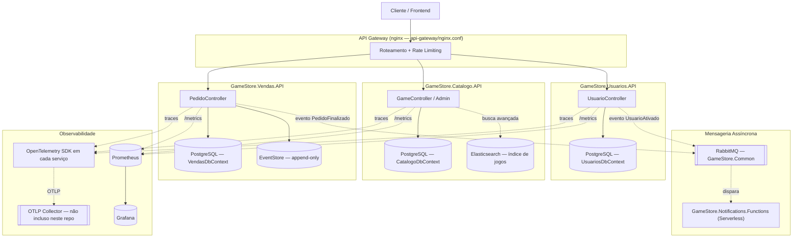
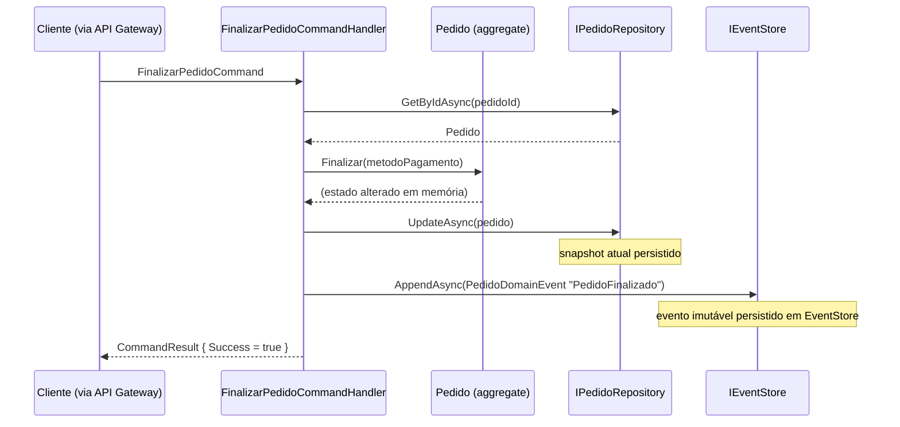

# Arquitetura — Fase 3 (Microsserviços)

> Branch: `release/fase-3-microservices`. Ver também `CLAUDE.md` (bounded contexts e leis invioláveis) e `docs/ai/tasks/prd-sprint-02-fase3.json` (PRD técnico).

## 1. Fluxo de Comunicação entre Serviços



**Regra de comunicação:** cada bounded context mantém seu próprio banco (nenhum acessa o `DbContext` de outro). Chamadas HTTP síncronas entre `GameStore.Usuarios`, `GameStore.Catalogo` e `GameStore.Vendas` são permitidas nesta fase (ver `docs/Objectives/sprint-2/DELIVERABLE.md` §Architectural Constraints — mensageria assíncrona obrigatória só é exigida a partir da Fase 4); hoje, porém, nenhum dos 3 serviços chama o outro. O único ponto de entrada síncrono externo é o API Gateway.

## 2. Distributed Tracing (OpenTelemetry)

Os 3 serviços (`GameStore.Usuarios.API`, `GameStore.Catalogo.API`, `GameStore.Vendas.API`) já registram, em `Program.cs`:

```csharp
builder.Services.AddOpenTelemetry()
    .ConfigureResource(r => r.AddService("<nome-do-servico>"))
    .WithTracing(t => t
        .AddAspNetCoreInstrumentation()   // captura spans de requisições recebidas
        .AddHttpClientInstrumentation()   // propaga o contexto de trace (W3C traceparent) em chamadas HttpClient de saída
        .AddOtlpExporter());              // exporta para um collector OTLP
```

- `AddAspNetCoreInstrumentation()` + `AddHttpClientInstrumentation()` juntos habilitam a propagação automática do header `traceparent` (padrão W3C Trace Context, propagador default do SDK do .NET) entre serviços que se chamam via `HttpClient`.
- **Estado real:** hoje nenhum dos 3 serviços chama o outro via HTTP síncrono (ver regra de comunicação acima), então não há uma cadeia de spans distribuída para observar ainda — a instrumentação está pronta, mas sem um cenário de chamada síncrona entre serviços não há o que propagar.
- Não há um collector OTLP (Jaeger/Tempo/Zipkin) configurado neste repositório — o `AddOtlpExporter()` exporta para `http://localhost:4317` por padrão, que precisa de um collector rodando para ser observado.

## 3. Event Sourcing — GameStore.Vendas

Esboço implementado em `GameStore.Vendas/Domain/EventSourcing/` e `GameStore.Vendas/Infrastructure/EventSourcing/`:

- `IEventStore.AppendAsync(DomainEvent)` — grava um evento imutável na tabela `EventStore` (append-only, chave primária `EventId`, indexada por `AggregateId`).
- Cada transição de estado do aggregate `Pedido` (`PedidoCriado`, `ItemAdicionado`, `ItemRemovido`, `PedidoFinalizado`, `PedidoCancelado`) é registrada como um `PedidoDomainEvent` pelos 5 command handlers em `GameStore.Vendas/Application/Handlers/PedidoCommandHandlers.cs`, **além** de (não em vez de) persistir o snapshot atual do `Pedido` via `IPedidoRepository`.
- `IEventStore.GetEventsAsync(aggregateId)` permite reconstruir a linha do tempo de um Pedido específico.



**Limitações conhecidas deste esboço** (para evolução futura, não implementado nesta fase):
- Não há replay/reconstrução de estado a partir dos eventos — o snapshot em `Pedidos`/`ItensPedido` continua sendo a fonte de leitura.
- Não há projeções (read models) derivadas do Event Store.
- Não há versionamento de schema de evento além do campo `EventVersion` (hoje sempre `1`).

## 4. Elasticsearch — Busca de Jogos no Catálogo

**Estado real:** um container `elasticsearch` (single-node, sem segurança, para uso local) foi adicionado ao `docker-compose.yml`. A indexação de jogos do `GameStore.Catalogo` e a query de busca via Elasticsearch **ainda não foram implementadas em código** nesta fase — ver `docs/ai/tasks/prd-sprint-02-fase3.json` (tarefa `fase3-T04`).

### Como validar o container Elasticsearch localmente

```bash
docker compose up -d elasticsearch

# 1. Confirmar que o cluster está saudável
curl http://localhost:9200/_cluster/health?pretty

# 2. Criar o índice de jogos manualmente (até a indexação automática ser implementada)
curl -X PUT http://localhost:9200/jogos -H "Content-Type: application/json" -d '{
  "mappings": {
    "properties": {
      "nome": { "type": "text" },
      "genero": { "type": "keyword" },
      "preco": { "type": "float" }
    }
  }
}'

# 3. Indexar um documento de teste
curl -X POST http://localhost:9200/jogos/_doc -H "Content-Type: application/json" -d '{
  "nome": "Elden Ring",
  "genero": "RPG",
  "preco": 199.90
}'

# 4. Buscar
curl "http://localhost:9200/jogos/_search?q=nome:Elden"
```

### Quando a indexação real for implementada

O teste de integração esperado (ainda não existe) deve:
1. Subir o container `elasticsearch` via `docker compose up -d elasticsearch` (ou Testcontainers.Elasticsearch, seguindo o mesmo padrão adotado em `TheThroneOfGames.Infrastructure.Tests` na branch `release/fase-2-monolito`, que usa Testcontainers para banco real em vez de mocks).
2. Criar/atualizar um jogo via `GameStore.Catalogo.API` e verificar que o documento correspondente aparece no índice Elasticsearch dentro de um tempo razoável (indexação assíncrona) ou imediatamente (indexação síncrona).
3. Rodar uma busca via Elasticsearch e validar que os resultados correspondem aos jogos disponíveis no `CatalogoDbContext`.

## 5. Serverless — GameStore.Notifications.Functions

Esboço de estrutura em `GameStore.Notifications.Functions/` (Azure Functions, isolated worker, `net9.0`):

- `Functions/NotificacaoPedidoFunction.cs` — notificação assíncrona ao usuário (hoje HTTP-triggered para demonstração local; em produção seria acionada por fila consumindo o evento `PedidoFinalizadoEvent`).
- `Functions/ProcessarPagamentoFunction.cs` — processamento assíncrono de pagamento, desacoplando `GameStore.Vendas.API` de um gateway de pagamento externo lento/instável.

```bash
cd GameStore.Notifications.Functions
func start   # requer Azure Functions Core Tools instalado
```

**Estado real:** ambas as funções são esboços (`Accepted` fixo, sem lógica de negócio real ainda) — preparam a estrutura pedida pelo edital, mas não estão conectadas a um trigger de fila real nem a um provedor de notificação/pagamento.

## 6. API Gateway

`api-gateway/nginx.conf`, servido pelo container `api-gateway` (porta `8080`). Roteia por prefixo de rota para cada microsserviço (ver tabela em `CLAUDE.md`) e aplica rate limiting básico (`limit_req_zone`). É um stub — não substitui autenticação/autorização, que continua sendo feita via JWT em cada microsserviço.
