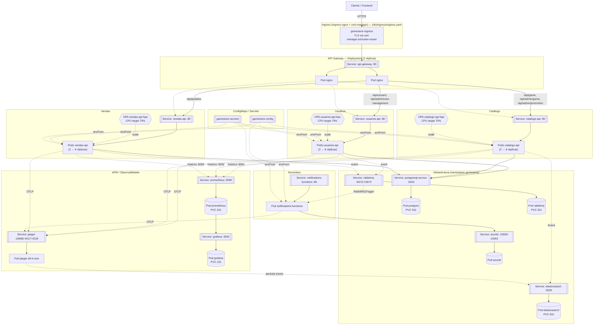

# Arquitetura — Fase 4 (Kubernetes & Escala)

> Branch: `release/fase-4-kubernetes`. Base: `release/fase-3-microservices` (bounded contexts e leis invioláveis inalterados, ver `CLAUDE.md`). Manifestos em `k8s/`, PRD técnico em `docs/Objectives/sprint-3/prd-fase4.json`.

## 1. Fluxo de Rede no Cluster (Ingress → Services → Pods → HPA → Infra/APM)

**Regras de rede:**
- Todo tráfego externo entra pelo `Ingress` → `api-gateway` → microsserviço. Nenhum `Service` de microsserviço é `LoadBalancer`/`NodePort` — todos são `ClusterIP` (ver `k8s/services/`), inacessíveis fora do cluster.
- Cada bounded context mantém seu schema isolado no `postgres` compartilhado (mesma topologia física de `docker-compose.yml`, ver `CLAUDE.md` §Leis Invioláveis) — nenhum serviço acessa o `DbContext` de outro.
- O HPA de cada API monitora CPU dos pods via `metrics-server` e ajusta `replicas` entre 2 e 6 independentemente por serviço — Catálogo pode escalar sem escalar Usuários/Vendas.
- `GameStore.Notifications.Functions` consome eventos via `[RabbitMQTrigger]` (fan-out do RabbitMQ), não é acionado pelo Ingress/Gateway.

## 2. Otimização de Imagens Docker (T02)

As 4 imagens (`GameStore.Usuarios.API`, `GameStore.Catalogo.API`, `GameStore.Vendas.API`, `GameStore.Notifications.Functions`) foram reconstruídas com:

- **Runtime Alpine** (`mcr.microsoft.com/dotnet/aspnet:9.0-alpine`, ~25MB base) para as 3 APIs — reduz superfície de ataque e tempo de pull em pods escalados pelo HPA. `icu-libs` instalado explicitamente para preservar globalização completa (Alpine não traz ICU por padrão).
- **Usuário non-root** (`appuser`, criado via `addgroup`/`adduser`) em todas as 4 imagens — nenhum container roda como `root` em produção.
- **`GameStore.Notifications.Functions`** mantém a base oficial Debian (`mcr.microsoft.com/azure-functions/dotnet-isolated:4-dotnet-isolated9.0`) — não existe variante Alpine publicada pela Microsoft para essa imagem — mas recebeu o mesmo hardening non-root.
- **Sem `curl`** em nenhuma das 4 imagens: os probes de produção usam `httpGet`/`tcpSocket` nativos do Kubernetes (executados pelo `kubelet` de fora do container, ver `k8s/deployments/`), e o `HEALTHCHECK` local do Docker (usado em `docker-compose.yml`/`docker run` avulso) passou a usar `wget` (busybox, já presente no Alpine).
- Validado com `docker build` real das 4 imagens nesta máquina (todas concluídas com sucesso) e smoke test confirmando `uid=appuser` (não-root) e ausência de `curl` em cada runtime.

**Bug real encontrado e corrigido durante a validação em cluster (não aparece em `docker build`, só rodando de verdade — ver §7):** non-root não consegue fazer `bind` em portas privilegiadas (<1024) no Linux, e Kestrel escuta na porta 80 (`Program.cs`, não alterado — fora do escopo desta fase). Um `docker run` avulso funciona por acidente porque o Docker Engine concede `NET_BIND_SERVICE` no capability set padrão de qualquer container; o `containerd`/CRI usado pelo Kubernetes **não** concede essa capability por padrão, e mesmo adicionando-a via `securityContext.capabilities.add` no Pod ela fica presa no *bounding set* e nunca chega ao *effective set* de um processo non-root (confirmado inspecionando `/proc/self/status` — `CapEff`/`CapAmb` zerados mesmo com `CapBnd` setado). Correção aplicada nos 4 Dockerfiles: `setcap cap_net_bind_service=+ep` diretamente no binário (`dotnet` nas 3 APIs, `Microsoft.Azure.WebJobs.Script.WebHost` na Function) — grava a capability nos xattrs do arquivo, que o kernel aplica ao *effective set* no `exec`, independente de propagação ambiente. O `securityContext.capabilities.add: ["NET_BIND_SERVICE"]` nos Deployments (`k8s/deployments/{usuarios,catalogo,vendas,notifications-functions}-*.yaml`) continua necessário — é o que garante que a capability exista no *bounding set* do container para o `setcap` poder concedê-la.

## 3. ConfigMaps e Secrets (T06)

- `k8s/configmaps/configmap.yaml` (`gamestore-config`) — toda configuração não sensível (ambiente, hosts internos, portas, flags de storage do Elasticsearch/Jaeger), migrada 1:1 das variáveis de `docker-compose.yml`.
- `k8s/configmaps/nginx-configmap.yaml` — espelha `api-gateway/nginx.conf`, montado via volume no Deployment do gateway.
- `k8s/secrets/secret.yaml` (`gamestore-secrets`, `type: Opaque`) — credenciais (Postgres, JWT, RabbitMQ, Grafana, Azurite) em base64, migradas dos mesmos placeholders de desenvolvimento já usados em `docker-compose.yml`/`.env.example`. Documentado no próprio arquivo que, em produção real, esses valores viriam de um cofre externo (Vault/Sealed Secrets/KMS do provedor), não de um Secret versionado.
- `k8s/configmaps/prometheus-configmap.yaml` e `k8s/configmaps/grafana-configmap.yaml` — scrape config do Prometheus e provisionamento (datasource + dashboard) do Grafana, espelhando `monitoring/prometheus.yml` e `monitoring/grafana/provisioning/` (ver §5).
- Os 3 APIs, o API Gateway (ConfigMap do nginx) e a Function consomem `gamestore-config`/`gamestore-secrets` via `envFrom` (`configMapRef` + `secretRef`), sem precisar mapear variável por variável.

## 4. Autoscaling — HPA (T05)

`k8s/hpa/{usuarios,catalogo,vendas}-api-hpa.yaml` — um `HorizontalPodAutoscaler` (`autoscaling/v2`) por API, `minReplicas: 2`, `maxReplicas: 6`, target de `70%` de utilização de CPU, com `stabilizationWindowSeconds: 120` no scale-down para evitar oscilação (scale up/down repetido) sob carga instável. Requer `metrics-server` no cluster (padrão em GKE Autopilot/EKS/AKS gerenciados).

**Validado com carga real** (ver §7 para o setup completo) usando `k8s/load-test/load-test-job.yaml` — um Job em cluster gerando tráfego concorrente sustentado contra as 3 APIs por 300s. Resultado observado:

| API | CPU de pico | Réplicas (min → pico) |
|---|---|---|
| catalogo-api | 105% (acima do target de 70%) | 2 → 6 (máximo configurado) |
| vendas-api | 66% | 2 → 4 |
| usuarios-api | 52% | 2 → 3 |

Após o fim da carga, as 3 APIs voltaram a `minReplicas: 2` dentro da janela de estabilização de scale-down configurada (120s) — ciclo completo de scale-up e scale-down confirmado em cluster real.

## 5. Monitoramento — Prometheus + Grafana (requisito funcional do edital)

- `k8s/deployments/prometheus-deployment.yaml` + `k8s/services/prometheus-service.yaml` — Prometheus (`prom/prometheus:latest`) com o scrape config de `k8s/configmaps/prometheus-configmap.yaml` (espelha `monitoring/prometheus.yml`), coletando `/metrics` das 3 APIs nas portas dedicadas do `prometheus-net` (`KestrelMetricServer` em cada `Program.cs`: `usuarios-api:9091`, `catalogo-api:9092`, `vendas-api:9093`).
- `k8s/deployments/grafana-deployment.yaml` + `k8s/services/grafana-service.yaml` — Grafana (`grafana/grafana:10.2.0`) com o datasource Prometheus e o dashboard "Overview" já existentes em `monitoring/grafana/` provisionados automaticamente via `k8s/configmaps/grafana-configmap.yaml` (dois ConfigMaps: `grafana-provisioning` e `grafana-dashboards`), sem precisar de bind mount de host.
- Validado em cluster: ambos os pods `Running`/`Ready`; Prometheus mostrou os alvos `usuarios-api`, `catalogo-api` e `vendas-api` como `up`, incluindo os picos de CPU do teste de carga do §4.

**Bug real encontrado e corrigido durante nova rodada de validação (docker-compose, 2026-07-13):** os 3 `Program.cs` registravam o `KestrelMetricServer` da porta dedicada (`9091`/`9092`/`9093`) no DI (`AddSingleton<IMetricServer>`) e depois só resolviam a instância (`app.Services.GetRequiredService<IMetricServer>()`) sem chamar `.Start()` — o comentário no código ("Ensures server is started") estava incorreto, resolver o singleton não inicia o listener do prometheus-net. Resultado: nada ouvia nas portas dedicadas dentro do container (`/metrics` só respondia na porta principal `:80` via `app.MapMetrics()`), o Prometheus marcava os 3 targets como `down` (`connection refused`) e o Grafana reportava erro ao consultar o datasource. Corrigido adicionando `metricsServer.Start();` nos 3 `Program.cs` (`GameStore.Usuarios.API`, `GameStore.Catalogo.API`, `GameStore.Vendas.API`). Revalidado: os 3 targets voltaram a `up` e o health check do datasource Prometheus no Grafana passou a retornar `"status":"OK"`. Como o binário é o mesmo usado em `docker-compose.yml` e nos Deployments de `k8s/`, esse bug também afetava (silenciosamente) a validação em cluster kind do parágrafo acima — a claim de "Prometheus mostrou os alvos... como up" não foi re-verificada nesta sessão para o ambiente kind, mas a causa raiz é a mesma e a correção se aplica igualmente lá.

## 6. APM / Distributed Tracing (T07)

`k8s/deployments/jaeger-deployment.yaml` sobe o Jaeger (`all-in-one:1.60`) como backend de APM do cluster, com o Elasticsearch do próprio cluster como storage (`SPAN_STORAGE_TYPE=elasticsearch`, evitando um segundo motor de storage só para traces). O `ConfigMap` `gamestore-config` define `OTEL_EXPORTER_OTLP_ENDPOINT: http://jaeger:4317` — resolvido via DNS interno do cluster pelo nome do `Service` `jaeger` — e é injetado nos 3 APIs e na Function via `envFrom`, preservando a mesma instrumentação OpenTelemetry já implementada na Fase 3 (`GameStore.Common/Tracing/TraceContextPropagator.cs`), agora apontando para o Jaeger do cluster em vez do container local do `docker-compose.yml`.

## 7. Validação local em cluster real (kind)

Diferente da Fase 3 (validada só via `docker-compose`), a Fase 4 foi validada de ponta a ponta em um cluster Kubernetes real rodando localmente — não um cluster gerenciado na nuvem (esse continua não provisionado nesta entrega, ver PRD `fase4-T03`), mas um cluster [kind](https://kind.sigs.k8s.io/) (Kubernetes-in-Docker) nesta máquina, o que exercita exatamente o mesmo `kubectl apply -f k8s/` que seria usado em GKE/EKS/AKS.

**Setup:** `kind create cluster` + `metrics-server` (com `--kubelet-insecure-tls`, necessário só porque os certs de kubelet do kind são self-signed — não se aplica a um cluster gerenciado real) + `ingress-nginx` (variante oficial para kind) + as 4 imagens locais carregadas via `kind load docker-image` (substituindo o pull de um registry, que não existe nesta entrega — ver §2).

**Resultado:** todos os 16 recursos (`namespace`, 2 `ConfigMap` extras de monitoramento, 3 `HorizontalPodAutoscaler`, `Ingress`, e os `Deployment`/`Service` de postgres, rabbitmq, elasticsearch, azurite, jaeger, prometheus, grafana, api-gateway, notifications-functions e das 3 APIs) subiram e ficaram `Ready` no cluster. Roteamento ponta a ponta confirmado via port-forward do `api-gateway`: `/health/usuarios`, `/health/catalogo`, `/health/vendas` e `/api/game/` responderam `200`.

**Dois bugs reais só visíveis rodando em cluster (não em `docker build` nem em `docker-compose`) foram encontrados e corrigidos nesta validação:**

1. **Non-root não conseguia fazer bind na porta 80** (as 3 APIs e a Function crash-loopavam com `SocketException: Permission denied`) — ver detalhe e correção em §2. Um `docker run` avulso mascarava esse problema porque o Docker Engine concede `NET_BIND_SERVICE` por padrão; o `containerd`/CRI do Kubernetes não.
2. **PostgreSQL de instância única esgotou conexões sob carga** (`sorry, too many clients already`) quando o HPA escalou para 6+4+3 = 13 réplicas simultâneas, cada uma com seu próprio pool de conexões Npgsql, contra o `max_connections=100` padrão do `postgres:16-alpine`. Corrigido aumentando para `max_connections=300` via `args` em `k8s/deployments/postgres-deployment.yaml` — achado relevante de capacidade para a Fase 4 ("Escala"): um único Postgres compartilhado é o gargalo real de uma topologia de APIs elasticamente escaladas, não os pods em si. Fica documentado aqui como limitação conhecida da topologia atual (um Postgres, sem pooler) — uma evolução futura razoável seria um PgBouncer na frente do Postgres.

**Teardown:** `kind delete cluster --name gamestore-local` ao final da sessão — nenhuma infraestrutura de nuvem foi provisionada ou permanece rodando.

## 8. Limitações conhecidas / fora do escopo desta entrega

- O cluster gerenciado real na nuvem (GKE/EKS/AKS) não foi provisionado nesta sessão — ver PRD `fase4-T03`. A validação funcional completa (deploy, HPA sob carga, monitoramento) foi feita em um cluster kind local (§7), o que prova que os manifests funcionam de ponta a ponta e ficam prontos para `kubectl apply -f k8s/` contra o cluster real escolhido para a gravação do vídeo de demonstração.
- Não há pipeline de CI/CD publicando as imagens em um registry — `image:` nos Deployments usa nomes placeholder (`gamestore/<serviço>:latest`) que devem ser substituídos pelo registry real (e `imagePullPolicy` ajustado) antes do `kubectl apply` contra um cluster remoto.
- Único Postgres compartilhado sem connection pooler dedicado (ver §7, achado 2) — suficiente para esta validação, mas um PgBouncer seria a evolução natural para uma topologia com muito mais réplicas.
