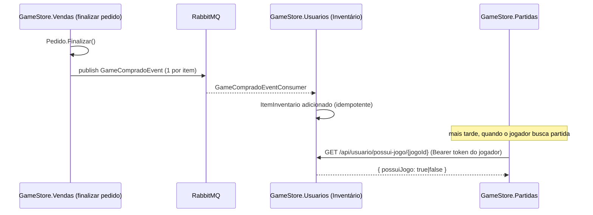
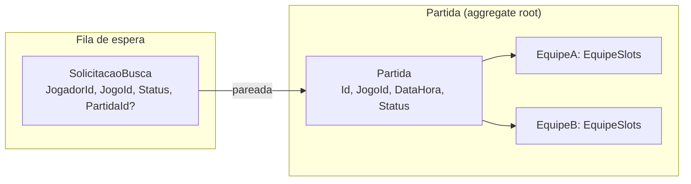
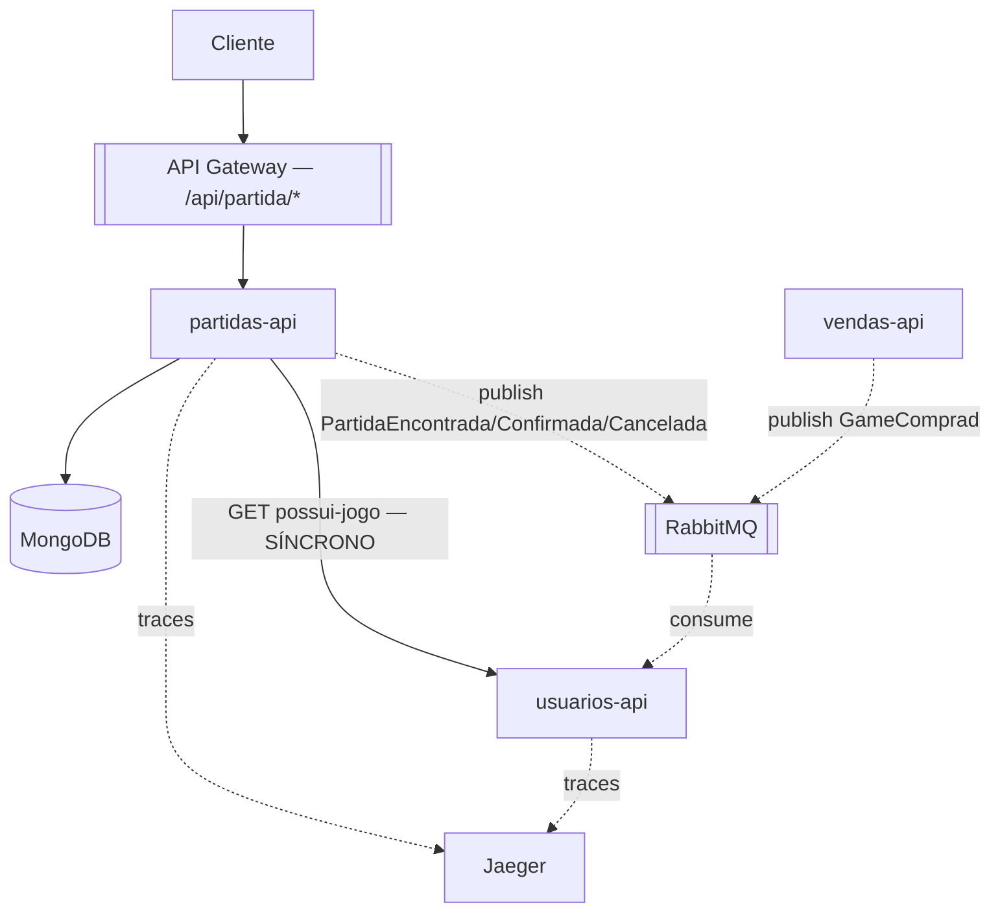

# Arquitetura — Partidas (Matchmaking)

> Branch: `release/fase-4-kubernetes`. Bounded context adicional, fora do escopo original do
> edital FIAP (Fases 2-4) — pedido do Arquiteto para o roadmap pós-entrega, adicionado em
> 2026-07-13. PRD técnico: `docs/ai/tasks/prd-partidas.json` (10 tarefas, todas concluídas e
> validadas ao vivo — ver `blockReason` de cada tarefa e `docs/ai/tasks/progress.txt`).

## 1. Por que este domínio existe

O FIAP Cloud Games (FCG), até a Fase 4, resolve o ciclo "usuário se cadastra → navega o
catálogo → compra um jogo". Não existe nenhum conceito de **jogar** o jogo — a compra é o fim
da jornada. O pedido do Arquiteto foi começar a preencher essa lacuna com a primeira peça de
um sistema de multiplayer: **matchmaking** — um jogador que já comprou um jogo pode procurar
uma partida, ser pareado com outro jogador buscando o mesmo jogo, e os dois confirmarem para a
partida começar.

Duas decisões de escopo deliberadas mantêm essa primeira versão pequena:
- **1v1 imediato**, não filas por time — a estrutura já suporta times maiores (`EquipeSlots`,
  teto de 5 jogadores) para uma evolução futura, mas o motor de pareamento só usa 1 slot por
  lado por enquanto.
- **Sem timeout de confirmação** — só desistência explícita desfaz uma partida formada. Um
  relógio de expiração automática fica para uma iteração futura (ver §7).

## 2. A que bounded context isso pertence

Nenhum dos 3 bounded contexts existentes (Usuários, Catálogo, Vendas — ver `CLAUDE.md`) modela
"uma sessão de jogo entre dois jogadores". É um conceito novo, com seu próprio ciclo de vida,
suas próprias regras de pareamento, e (decisão consciente, ver §4) sua própria tecnologia de
persistência — por isso é um **4º bounded context**, `GameStore.Partidas`, não um apêndice de
Vendas ou Catálogo.

Isso NÃO significa isolamento total: Partidas depende de **posse do jogo**, um fato que só o
domínio Usuários conhece (ver §3) — a primeira dependência síncrona entre bounded contexts
deste sistema.

## 3. Inventário — pré-requisito em Usuários, não em Partidas

Antes de poder buscar uma partida, o jogador precisa **já ter comprado o jogo**. A pergunta
"quais jogos o jogador X possui?" não é responsabilidade de Partidas — decisão do Arquiteto:
o Inventário pertence ao domínio **Usuários** ("o inventário pertence ao usuário que
comprou"), não a Vendas nem a um novo conceito de "Jogador" separado (esse split fica
propositalmente para uma evolução futura).

**Achado de implementação:** `GameCompradoEvent` já existia no código (`GameStore.Common.Events`,
com o shape certo — `GameId`/`UserId`/`Preco`/`NomeJogo`) e já tinha fila declarada no
`RabbitMqAdapter` (`usuarios.game-comprado`), mas **nunca era publicado nem consumido** — código
morto de uma iteração anterior. Em vez de estender `PedidoFinalizadoEvent` com uma lista de
`JogoIds` (plano original), a implementação terminou de ligar esse mecanismo já existente:
`FinalizarPedidoCommandHandler` (Vendas) agora publica 1 `GameCompradoEvent` por item, e
`GameCompradoEventConsumer` (Usuários, existia, só logava) agora persiste no `ItemInventario`.

O endpoint `GET /api/usuario/possui-jogo/{jogoId}` identifica o jogador pelo claim `sub` do
próprio JWT da requisição — por isso mora no domínio que já é dono da identidade, e por isso
`BuscarPartidaUseCase` (Partidas) simplesmente repassa o Bearer token recebido, em vez de
duplicar lógica de autenticação.

## 4. Persistência — MongoDB, não Postgres

Diferente dos outros 3 bounded contexts (Postgres compartilhado, schemas isolados — ver
`CLAUDE.md`), Partidas usa **MongoDB**, autohospedado no cluster (mesmo padrão de
Postgres/RabbitMQ/Elasticsearch — não um serviço gerenciado de uma cloud específica, para não
prender essa parte da arquitetura a um único provedor).

- Coleções: `partidas` e `solicitacoesBusca`.
- **Purge automático de 60 dias** via índice TTL do Mongo (`expireAfterSeconds`) sobre um campo
  `CriadoEmParaTtl` — sem job/cron adicional (ver `PartidasMongoContext.EnsureIndexesAsync`).
- As entidades de domínio (`Partida`, `SolicitacaoBusca`) têm construtores/setters privados por
  design (DDD) — o driver do Mongo não consegue popular isso via reflexão simples. A solução:
  documentos de persistência separados (`PartidaDocument`/`SolicitacaoBuscaDocument`) e fábricas
  internas de reidratação (`Partida.Reidratar(...)`, `internal`, só usadas pelo repositório na
  mesma assembly) — mantém o domínio puro sem abrir os setters para o mundo externo.
- **Bug real encontrado e corrigido:** desde o MongoDB.Driver 3.x, serializar `Guid` exige uma
  `GuidRepresentation` explícita — sem registrar `GuidSerializer(GuidRepresentation.Standard)`,
  qualquer filtro por Guid lança `BsonSerializationException` em runtime (só aparece rodando de
  verdade, não em `dotnet build`).

## 5. Modelo de domínio

- **`Partida`** — aggregate root. Identidade técnica é `Id` (Guid); "jogo + equipeA + equipeB +
  partida" do pedido original vira o *conjunto de atributos* que descreve a partida
  (`JogoId` + as duas `EquipeSlots`), não uma chave composta literal.
- **`EquipeSlots`** — Value Object imutável, lista de `JogadorId` capada em 5 (`LimiteMaximo`).
  No fluxo 1v1 atual, cada equipe sempre tem exatamente 1 jogador — o teto fica pronto para uma
  evolução futura sem quebrar o modelo.
- **`SolicitacaoBusca`** — um jogador procurando partida. `Aguardando` → `Pareada` (quando
  formar uma `Partida`) → pode voltar para uma **nova** `SolicitacaoBusca(Aguardando)` se a
  partida for desfeita por desistência do outro jogador.
- **Eventos de domínio** (`GameStore.Common.Events`, publicados no RabbitMQ, mesmo padrão de
  `PedidoFinalizadoEvent`): `PartidaEncontradaEvent`, `PartidaConfirmadaEvent`,
  `PartidaCanceladaEvent` — sem consumer dedicado ainda (publicados para observabilidade/
  telemetria e para uma evolução futura de notificação).

### Regras de negócio

| Regra | Comportamento |
|---|---|
| Trigger de match | **1v1 imediato** — assim que há 2 `SolicitacaoBusca(Aguardando)` para o mesmo jogo, a `Partida` nasce. |
| Confirmação | Sem timeout automático. Cada jogador chama `/confirmar`; quando **todos** confirmam, `Status = Confirmada`. |
| Desistência | Se um jogador desiste antes da confirmação mútua: `Partida → Cancelada`, o outro jogador ganha uma **nova** `SolicitacaoBusca(Aguardando)`, e o motor de pareamento tenta formar uma partida nova **na hora** (mesmo request HTTP). |
| Posse do jogo | Verificada em `GameStore.Usuarios` antes de entrar na fila — sem o jogo, `BuscarPartidaUseCase` rejeita com `JOGADOR_NAO_POSSUI_JOGO` sem criar nenhuma `SolicitacaoBusca`. |

## 6. Fluxo de rede / comunicação

A chamada `partidas-api → usuarios-api` é a **primeira comunicação HTTP síncrona entre bounded
contexts** deste sistema (até aqui, Usuários/Catálogo/Vendas só se comunicavam via RabbitMQ,
quando se comunicavam). Trace-propagation via `HttpClientInstrumentation` garante que essa
chamada aparece como um span filho no mesmo trace do Jaeger — verificado ao vivo (ver §8).

## 7. Observabilidade e validação

- **Métricas**: `partidas-api` expõe `/metrics` na porta dedicada `9094` (prometheus-net),
  seguindo exatamente o padrão dos outros 3 serviços — inclusive já nasceu com
  `metricsServer.Start()` explícito (ver `docs/ai/skills/dotnet-clean-arch.md` §8, bug
  encontrado e corrigido nos outros 3 serviços antes deste ser escrito).
- **Tracing**: OpenTelemetry com `AddAspNetCoreInstrumentation` + `AddHttpClientInstrumentation`
  (cobre a chamada síncrona a Usuários) + `AddSource("GameStore.Common.Messaging")` (cobre
  publish/consume no RabbitMQ).
- **Script de validação** (`tools/validate-partidas.js`): roda ao vivo contra o ambiente real
  (`docker compose up`), cruzando 3 fontes de evidência — resposta da API, documento persistido
  no MongoDB (`docker exec mongodb mongosh`), e trace real no Jaeger. Cobre os 5 critérios de
  aceite do PRD (posse do jogo, rejeição sem posse, pareamento 1v1, confirmação mútua,
  desistência + reenfileiramento). Última execução: **15/15 critérios passaram**.

## 8. Limitações conhecidas / evolução futura

- **Sem timeout de confirmação** — decisão deliberada desta versão (ver §5), não uma omissão.
  Uma partida formada só se desfaz por desistência explícita; um jogador que trava sem
  confirmar nem desistir prende o outro indefinidamente. Uma expiração automática (ex.: 30s) é
  a evolução natural.
- **1v1, não NvN** — `EquipeSlots` já suporta até 5 jogadores por time, mas o motor de
  pareamento (`MotorDePareamento`) só forma partidas assim que há 2 pessoas, não espera as
  equipes encherem. Generalizar isso é a evolução natural para partidas maiores.
- **Sem validação síncrona de `JogoId` contra o Catálogo** — `Partidas` confia no `JogoId`
  recebido como um Guid opaco; não confirma com `catalogo-api` que o jogo existe de fato.
  Simplificação deliberada desta primeira versão.
- **`IUsuariosGateway` sem circuit breaker/retry** — se `usuarios-api` estiver fora do ar, toda
  busca de partida falha (fail-closed, correto do ponto de vista de segurança: sem confirmar
  posse, não libera a fila) mas sem resiliência a instabilidade transitória.
